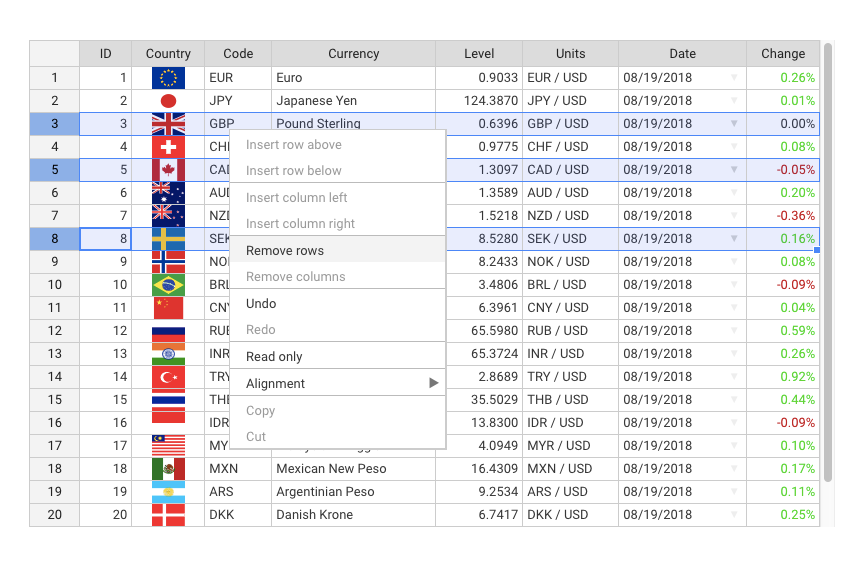

<div align="center">
  <a href="//handsontable.com" target="_blank"></a>
</div>

[**Handsontable Community Edition (CE)**](//handsontable.com) is an open source JavaScript/HTML5 data grid component with spreadsheet look & feel. It easily integrates with any data source and comes with a variety of useful features like data binding, validation, sorting or powerful context menu.

If you are looking for an extended version, try out [Handsontable Current Version](//github.com/handsontable/handsontable).

----

<br/>

## Table of contents

1. [What to use it for?](#what-to-use-it-for)
1. [Installation](#installation)
2. [Basic usage](#basic-usage)
3. [Examples](#examples)
4. [Features](#features)
5. [Screenshot](#screenshot)
6. [Resources](#resources)
7. [Wrappers](#wrappers)
8. [Support](#support)
9. [Contributing](#contributing)
10. [Community](#community)
11. [License](#license)

<br/>

### What to use it for?
The list below gives a rough idea on what you can do with Handsontable CE, but it shouldn't limit you in any way:

- Database editing
- Configuration controlling
- Data merging
- Team scheduling
- Sales reporting
- Financial analysis

<br/>

### Installation
There are many ways to install Handsontable CE, but we suggest using npm:
```
npm install handsontable
```

**Alternative ways to install**
- See the [download section](//github.com/nhereveri/handsontableCE/releases) on how to install Handsontable CE using nuget, bower, yarn and more.

<br/>

### Basic usage
Assuming that you have already installed Handsontable CE, create an empty `<div>` element that will be turned into a spreadsheet:

```html
<div id="example"></div>
```
In the next step, pass a reference to that `<div>` element into the Handsontable CE constructor and fill the instance with sample data:
```javascript
var data = [
  ["", "Tesla", "Volvo", "Toyota", "Honda"],
  ["2017", 10, 11, 12, 13],
  ["2018", 20, 11, 14, 13],
  ["2019", 30, 15, 12, 13]
];

var container = document.getElementById('example');
var hot = new Handsontable(container, {
  data: data,
  rowHeaders: true,
  colHeaders: true
});
```

<br/>

### Examples
- [See a live demo](//handsontable.com/examples.html)

<br/>

### Features

**Some of the most popular features include:**

- Sorting data
- Data validation
- Conditional formatting
- Freezing rows/columns
- Merging cells
- Defining custom cell types
- Moving rows/columns
- Resizing rows/columns
- Context menu
- Adding comments to cells
- Dragging fill handle to populate data
- Internationalization
- Non-contiguous selection

[See a comparison table](//handsontable.com/docs/6.2.2/tutorial-features.html)

<br/>

### Screenshot
<div align="center">
<a href="//handsontable.com/examples.html">

</a>
</div>

<br/>

### Resources
- [API Reference](//handsontable.com/docs/6.2.2/Core.html)
- [Compatibility](//handsontable.com/docs/6.2.2/tutorial-compatibility.html)
- [Change log](//github.com/nhereveri/handsontableCE/releases)

<br/>

### Support
Report all the suggestions and problems on [GitHub Issues](//github.com/nhereveri/handsontableCE/issues).

<br/>

### Community
- [Stackoverflow](//stackoverflow.com/tags/handsontable)

<br/>

### License
Handsontable Community Edition is released under the MIT license. [Read license](//github.com/nhereveri/handsontableCE/blob/master/LICENSE).

Copyrights belong to Handsoncode sp. z o.o.
